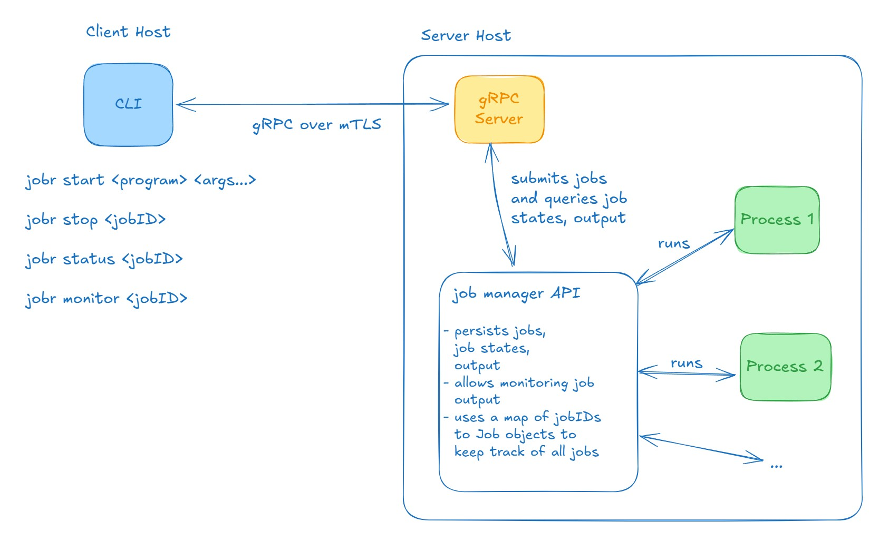
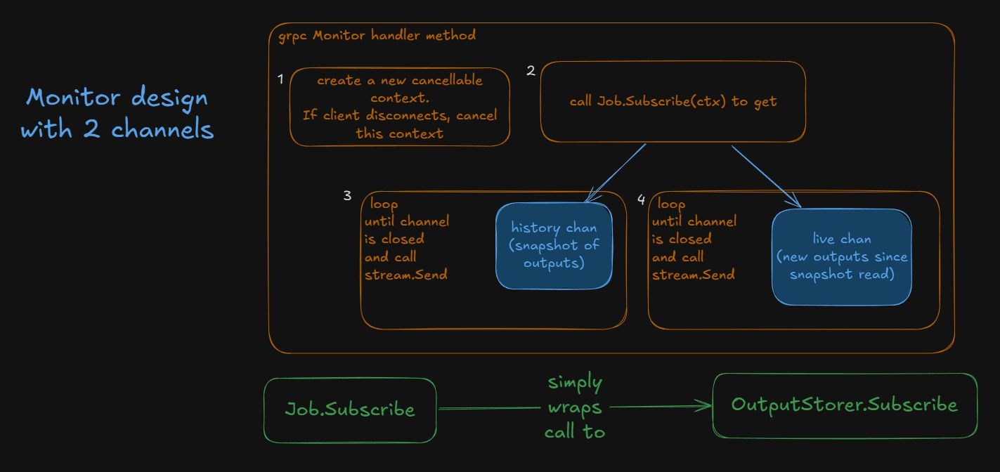
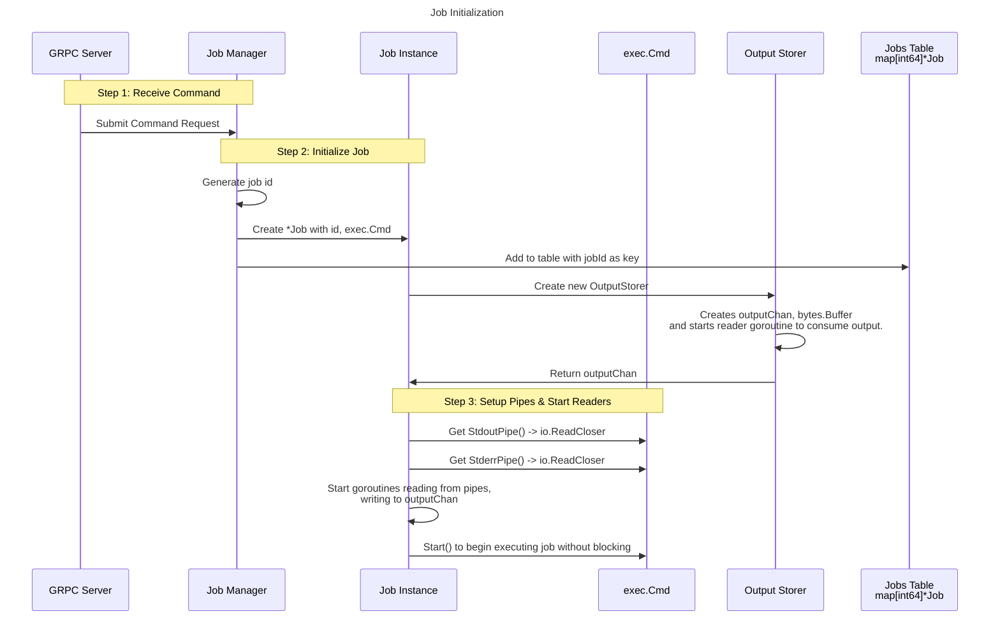
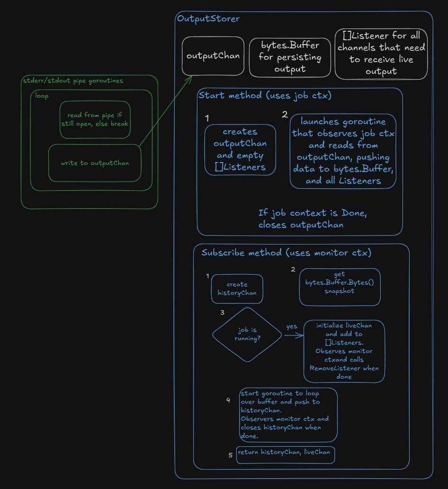

# Job Runner Service

This document describes a solution for a remote job execution service to run arbitrary linux processes.

## Design Principles

This design aims to be modular, performant, and reliable. Implementation of the core components will strive to attain the minimum required functionality with expressive APIs that work well with each other.

Opportunities for improvements, or abbreviations of certain features will be indicated in comments.

The implementation strives to showcase the strengths of Go for managing concurrent workflows and gRPC for performant, secure communication.


## Overview

The system comprises of 3 core components.
- A CLI app to start, stop, monitor and list jobs.
- A Server that delegates actions to a job manager library and returns results to the client.
- A job manager library to abstract the implementation details of job execution, persistence, and queries.

There is no restriction on the commands to be executed and they can target any program available on the machine hosting the gRPC server.

A job's output can be text or raw binary data and is streamed to the client when they start or monitor a job.

The following diagram illustrates the commands, core modules and how they relate to each other.



## Authentication and Authorization

The system uses mTLS authentication to create a secure communication channel between CLI clients and the gRPC server.

TLS Version 1.3 is used which does not require any cipher suite preferences.

For development and testing:
- A self-signed CA cert will be generated.
- 3 RSA key pairs will be generated to set up the client user, client admin, and server. All certs will be signed with the generated CA.

The server will use the CN name contained in the client certificate to determine the client's role; either `user` or `admin`.

### Role differences
- Users can list the status of, monitor and stop jobs that they submitted.
- Admins can list the status of, monitor and stop jobs submitted by _any_ user.

## Security Vulnerabilities

Since the app explicitly enables the execution of any program on the server, vulnerabilities include
- Downloading and running malware using `curl`
- Reading sensitive data or config files with `cat`
- Destroying files using `mv path/to/file /dev/null` or `rm`
- Mutating config values using `sed`
- Killing running processes for disruption
- Launching processes that exhaust system resources

In short, a user can wreak catastrophic havoc on the system and organization.

If commands can be executed in a sandboxed environment with bounded resources, and without direct access to the server host, some of these risks can be mitigated.


## CLI

The `jobr` CLI app is a user-friendly interface for remote job execution and management.

`-h` or `--help` - Provides CLI usage information.

For mTLS authentication, the client must set environment variables:
- `CLIENT_CERT_FILE` - Path to public certificate containing identity information and public key.
- `CLIENT_KEY_FILE` - Path to private key file to generate a signature that the server verifies.
- `CLIENT_CA_FILE` - Path to CA cert to verify server certificate.

### Commands 

#### Start

`start <program> <args...>`

The CLI application receives the program and all specified arguments.
It submits the given program with its arguments (`os.Args[2:]`) to the server and receives the assigned job id.

The job id is printed to `stdout` directly.

Example
```sh
$ jobr start echo Hello!
1
```


#### Status

`status <jobId>`

Gets the job status for the given job id. An admin can get the status of any job, while a user can only get the status of jobs they submitted.

Example for a successful job
```sh
$ jobr status 1
Status:COMPLETED ExitCode:0
```

Example for a job where the program was not found. The client can use the `monitor` command to see the errors since it combines both `stdout` and `stderr` streams.
```sh
$ jobr status 1
Status:FAILED ExitCode:127
```


#### Stop

`stop <jobId>`

Stops the job denoted by the given `jobId`. The `jobId` is an integer value assigned to each submitted job by the job manager.
A user can stop jobs they have started, while an admin can stop any job.
An empty response indicates success, while an error with a status code provides information for why the job couldn't be stopped (NOT_FOUND, UNAUTHORIZED).

Example
```sh
$ jobr stop 1
stop succeeded
```


#### Monitor

`monitor <jobId>`

Queries the job's output from the beginning and tails it until it ends or the user presses ctrl+c.
A user can monitor jobs they have started, while an admin can monitor any job.

Example
```sh
$ jobr monitor 1
test
```


## GRPC Server

The gRPC Server implements handlers for all supported job actions listed in the `.proto` file. For certain rpc methods, the responses differ based on the client's role derived from their certificate identity.

The server is responsible for
- Implementing all RPC methods defined in the `.proto` file with appropriate responses and status codes.
- Authentication using mTLS with client and server certificates and authorization using CN name derived from the client certificate.

For mTLS authentication, the server env must set environment variables:
- `SERVER_CERT_FILE` - Path to public certificate containing identity information and public key.
- `SERVER_KEY_FILE` - Path to private key file to generate a signature that the client verifies.
- `SERVER_CA_FILE` - Path to CA cert to verify client certificate.

### Monitor RPC Method

This diagram describes the arcitecture of the Monitor handler that uses 2 channels to capture and send all data.


When the monitor method starts, we create a client specific cancellable context, that is related with the `request.Context`.
- If the client disconnects and `request.Context` is Done, we cancel the monitor's `ctx` to model the ctrl+c behavior.
- Cancelling the monitor's context will affect all observers of the context.
  
  The `OutputStorer.Subscribe` method receives the cancellation signal, and closes both `historyChan` and `liveChan`, and removes the listener that contains `liveChan`.

## Job Manager API Libary

The job manager library implements the functionality to start, stop, persist and monitor job executions on the server.

Note that all data is persisted in-memory and will be lost when the GRPC Server restarts.

It is responsible for
- Accepting new jobs for concurrent job execution using a worker pool.
- Persisting job metadata and outputs for each submitted job.
  - Job ID is an `int64` value that is set from an incrementing `atomic.Int64` to guarantee uniqueness. When creating a new Job value, the manager adds to the atomic int, and assigns the new value as the id.
  - Job output is stored in a `bytes.Buffer`
- Updating the job status appropriately
  - `pending` for jobs accepted but not started
  - `running` for jobs executing on the server
  - `completed` for jobs that finished execution successfully
  - `failed` for jobs that finished execution with a nonzero exit code
  - `stopped` for jobs that were explicitly stopped by a user or admin
- Tailing job output independent of job execution.
- Gracefully stopping a job by cancelling the `exec.Cmd` context. 

### Output Streaming

A job can be monitored by multiple clients during job execution and afterwards.
The client receives all output from the beginning, before tailing the output if the job is running.

This is current implementation plan to achieve this behavior.

1. Job manager receives a new command from the GRPC Server to execute.
2. It initializes a new `Job` value with a new job id, an `exec.Cmd` value, and an `OutputStorer` that encapsulates a `bytes.Buffer` as an in-memory store. When an `OutputStorer` is created with `New`, it provides an `outputChan` which the caller can send job outputs to.
3. The `exec.Cmd` type lets the job manager access the `StdoutPipe` and `StderrPipe` as `io.ReadCloser` values. The manager creates and starts two goroutines to read from each pipe and write to an `outputChan`.
4. Once the command starts running, it's output gets piped to the `outputChan`. In order to broadcast the live output and allow decoupled listeners, the `OutputStorer` type has a collection of listeners `[]Listener`. Each `Listener` provides a channel on which to send the live output. 

   The goroutine in `OutputStorer` that reads from `outputChan` to push to the internal `bytes.Buffer`, will also iterate over the `Listeners` collection, and push to each `liveChan`.
5. Any new requests to monitor the output after a job is complete will simply get the historcal data from the `historyChan`.
  
The sequence diagram describes the flow.



This diagram describes the `OutputStorer` and the pipe goroutines.




### Stopping a Running Job

To stop a running job, the plan is to use a cancellable context created when the job is initialized, and run `cancel()` when a `Stop` request is received.

The manager passes this context to the [CommandContext](https://pkg.go.dev/os/exec#CommandContext) function to get an `exec.Cmd` reference.

This allows the command to invoke it's `Cancel` function to kill the process when the context is done.

The `StderrPipe` and `StdoutPipe` streams will subsequently close, causing the goroutines reading from them to close any listener channels before returning.


## Tests

Automated tests for the following behaviors will be implemented:
- Server should only get the job status of job ids scoped to that user, and allow admins to get the status of any job id. (authorization scope test)
- Server should reject requests from clients with an invalid certificate (mTLS auth middleware test).
- Job manager should allow executing, and monitoring jobs concurrently without data races.